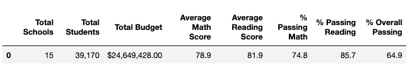
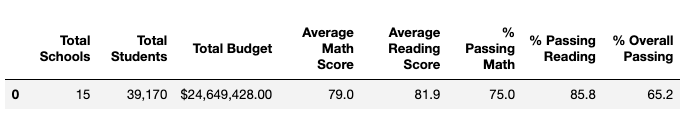
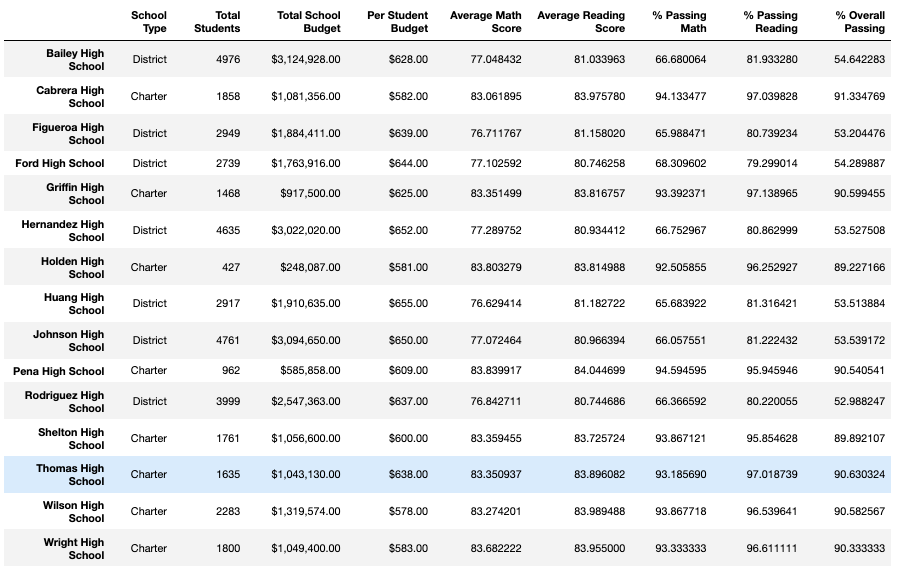
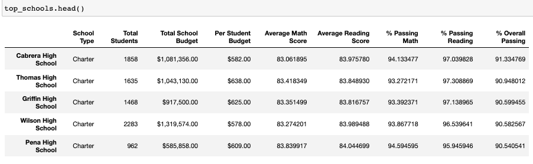
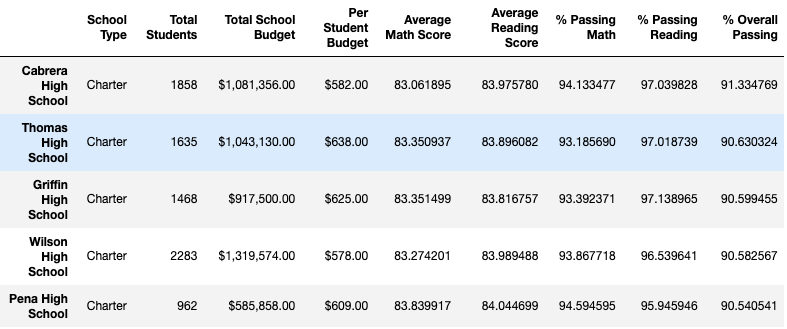

# School_District_Analysis

## Overview of the Project
This project is to help Maria, a chief data scientist for a city school district, who was tasked with preparing all standard test data for analysis, reporting and presentation to provide insights about performance trends and patterns. The school board found some acdemic dishonesty in the students grades in this report, and they wanted Maria to update this report to uphold state-testing standards. 

We used panda in Python to help Maria audit this report. In the new report, we replaced the reading and Maths score of 9th Grade of Thomas High School to NaN. This change affected some of the results that were previously presented, with details listed below.

## Results: 

### The School District Summary

- Updated Summary

- Previous Summary

 
 - We can see from the two tables that the updated district summary has a slightly drop for Math, reading and overall passing rate. The Math passing rate dropped from 75.0% to 74.8%. The reading passing rate dropped from 85.8% to 85.7%. The overall passing rate dropped from 65.2% to 64.9%. This change was caused obviously, from replacing the Thomas High School 9th Grades' scores to NaN.
  - 
### The school summary 
- New School Summary
- 

- We can see from the comparison that all other schools' data was the same as before except Thomas High School's (THS). The overall reading and math passing rate of THS plummeted after we omitted the THS's 9th grade's scores. The math passing rate of THS decreased to 66.91%. The reading passing rate of THS dropped 69.66%. Thus, the overall passing dropped to 65.07%. The drop percentage was about 39%. Although when we calculated the 10th to 12th grades' math and reading scores seperately, the performances of THS was still pretty good compared with those of other schools, we could not tell the extent of dishonesty in the performance of TH 9th grade.

### School Performance Comparison
- Thomas High School is still in the Top 5 Schools

- Top 5 School Before the replacement in the Module

- 

- Top 5 School after the replacement in the Challenge

- 

- We can see from the comparison that if we just ignored the THS 9th grade students numbers and theirs scores completely and only calculate the 10th to 12th grade students' performances, THS is still in the top 5 schools in terms of academic performance. The math passing rate just fell from 93.27% to 93.19%. The reading passing rate fell from 97.31% to 97.02%. Thus the overall passing rate fell from 90.95% to 90.63%. 

### Other affect after score replacement:
  - Math and reading scores by grade were not affected too much except that all 9th grade's scores of Thomas High School were now NaN.
  - Scores by school spending would be slightly inluenced in terms of passing percentage in the catergory of spending between $631 to $645. Because THS     fell in this catergory and the 9th grade scores replacement will influence the overall passing percentage in this spending range. However, after we     replace the THS performance with only 10th to 12th students number, the overall data is close to the previous report.
  - Similarly, Scores by school size would be affected in the "Medium (1000-1999)" catergory, as this was school size range for THS. But if we also only     use student number of 10th to 12th grade of THS. This affect is tiny.
  - Scores by school type would be affected slightly because THS was a Charter School. But since the performance gap between Charter schools and district school was huge, the overall scores and passing rate of Charter Schools would always be higher than District schools.
  -

## Summary: 

1. The replacement of the scores to NaN for the ninth grade of Thomas High School(THS) led to a decrease in the district passing student number. 
2. While the total student number did not change, the percentage for math, reading and overall passing rate decreased for overall school district. 
3. Thomas High School would would still be in the top 5 if we only calculate their students' performances from grade 10 to 12. However, they will no longer be among within the Top 5 School in acdemic performance if the 9th grade's scores were taken away, based on the overall district summary with its overall passing rate at around 65%.
4. The replacement has small affects to the results of "scores by school spending", "scores by school size" and "scores by school types" based on our analysis above. Because THS's students' number is not too much, compared to the whole district student number. However, it will influences the data in the catergories that THS belongs to, such as the "scores by school spending" at $631 to $645 range, and the charter type performance in "scores by school type".
5. The replacement had very little impact on "Scores by Grade" because it only changed the 9th grade's scores of Thomas High School, but nothing else changed in this dataframe. 

