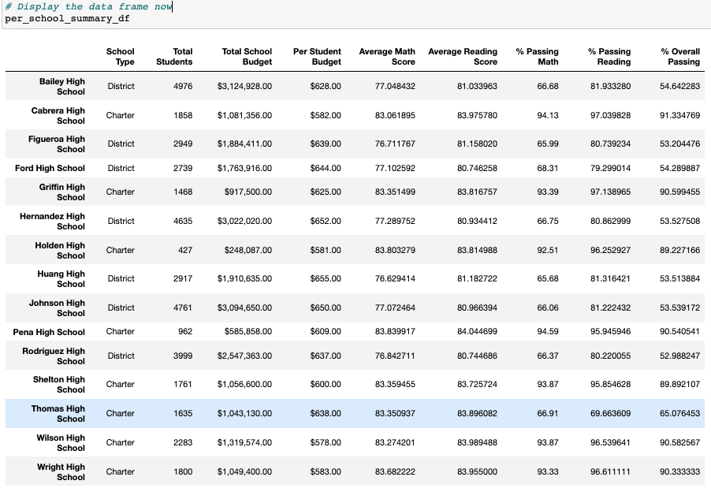

# School_District_Analysis

## Overview of the Project
This project is to help Maria, a chief data scientist for a city school district, who was tasked with preparing all standard test data for analysis, reporting and presentation to provide insights about performance trends and patterns. Unfortunately, the school board found some academic dishonesty in the students' grades in this report, and they wanted Maria to update this report to uphold state-testing standards. 

We used panda in Python to help Maria audit this report. In the new report, we replaced the reading and math scores of the 9th Grade of Thomas High School with NaN. This change affected some previously presented results, with details listed below!

## Results: 

### The School District Summary

- Updated Summary

- Previous Summary

 
 - We can see from the two tables that the updated district summary has a slight drop in Math, reading, and overall passing rate. The Math passing rate dropped from 75.0% to 74.8%. The reading passing rate dropped from 85.8% to 85.7%. Finally, the overall passing rate dropped from 65.2% to 64.9%. This change was caused obviously, by replacing the Thomas High School 9th Grades' scores with NaN.

### The school summary 
- New School Summary

- From the comparison, we can see from the comparison that all other schools' data was the same as before except Thomas High School(THS). The overall reading and math passing rate of THS plummeted after we omitted the THS's 9th-grade scores. The math passing rate of THS decreased to 66.91%. The reading passing rate of THS dropped to 69.66%. Thus, the overall passing dropped to 65.07%. The drop percentage was about 39%. Although when we calculated the 10th to 12th grades' math and reading scores separately, the performances of THS was still pretty good compared with those of other schools, we could not tell the extent of dishonesty in THS 9th grade.

### School Performance Comparison

- Top 5 Schools Before the replacement in the Module

- Top 5 Schools after the replacement in the Challenge

- We can see from the comparison that if we just ignored the THS 9th grade student number and their scores completely and only calculated the 10th to 12th grade students' performances, THS is still in the top 5 schools in terms of academic performance. The math passing rate just fell from 93.27% to 93.19%. The reading passing rate fell from 97.31% to 97.02%. Thus, the whole passing rate fell from 90.95% to 90.63%. 

### Other changes after score replacement:
- Math and reading scores by grade were not affected too much except that all 9th-grade scores of Thomas High School were now NaN.
- Scores by school spending would be slightly influenced in the passing percentage under expenditures between $631 to $645. Because THS fell in this category and the 9th-grade scores replacement will affect the overall passing rate in this spending range. However, after replacing the THS performance with only 10th to 12th students' performances, the general data was close to the previous report.
- Similarly, Scores by school size would be affected in the "Medium (1000-1999)" category, as this was the school size range for THS. But if we also only counted students of 10th to 12th grade of THS. This effect is tiny.
- Scores by school type would be affected a little because THS was a Charter School. But since the performance gap between Charter schools and district schools was huge, the overall scores and passing rate of Charter Schools would always be higher than District schools.

## Summary: 

1. The replacement of the scores to NaN for the ninth grade of THS led to a decrease in the district passing student number. 
2. While the total student number did not change, the percentage for math, reading, and the overall passing rate decreased for the whole school district. 
3. Thomas High School was still in the top 5 when we only calculated their students' performances from grade 10 to 12. However, they will no longer be among the Top 5 Schools in academic performance if we include their 9th-grade students in their total student number. As shown in the district summary above, this would give them an overall passing rate of around 65%.
4. The replacement has minor effects on the results of "scores by school spending", "scores by school size," and "scores by school types" based on our analysis above. Because THS's size is small, comparing its student number with the one of the whole school district. However, it will influence the data in the categories that THS belongs to, such as the "scores by school spending" at the $631 to $645 range and the charter type performance in "scores by school type."
5. The replacement had minimal impact on "Scores by Grade" because it only changed the 9th grade's scores of Thomas High School, but nothing else changed in this DataFrame.

